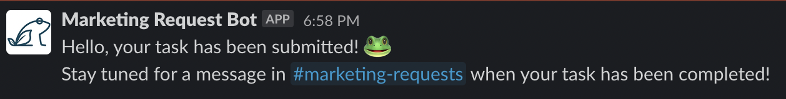
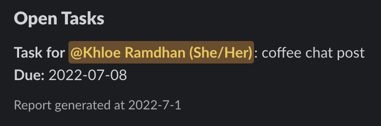
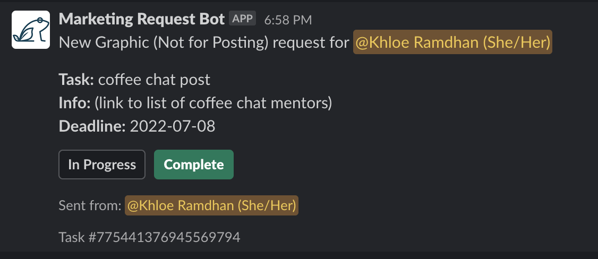
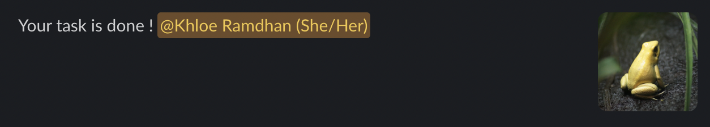

# Marketing Request Bot
This Slack bot was created for LEAP Canada's marketing department to help streamline the process of creating and completing tasks.

Built with `Node`, `Bolt.js`, `CockroachDB` and `Sequelize ORM`

Commands:

`/new-request` 

* allows users to fill in a request form and inserts task in SQL database
* sends message to responsible department channel to complete task
* sends direct message to member sending request to confirm it has been created

`/view-tasks` 

* generates a report of all not completed tasks to help check status
  

**Preview**

Each message contains a In Progress button (reacts to message with 👀) and Complete button (reacts to message with ✅ and deletes task from database)

## How to Use

* Visit [api.slack.com](https://api.slack.com/) for instructions to set up your bot on your desired Slack workspace
* Clone this repo and run `npm install`
* Create environmental variables for `SLACK_SIGNING_SECRET`, `SLACK_BOT_TOKEN` and `SLACK_APP_TOKEN` from the Slack API website
* Set up a CockroachDB cluster and create another environmental variable for your `DATABASE_URL`
